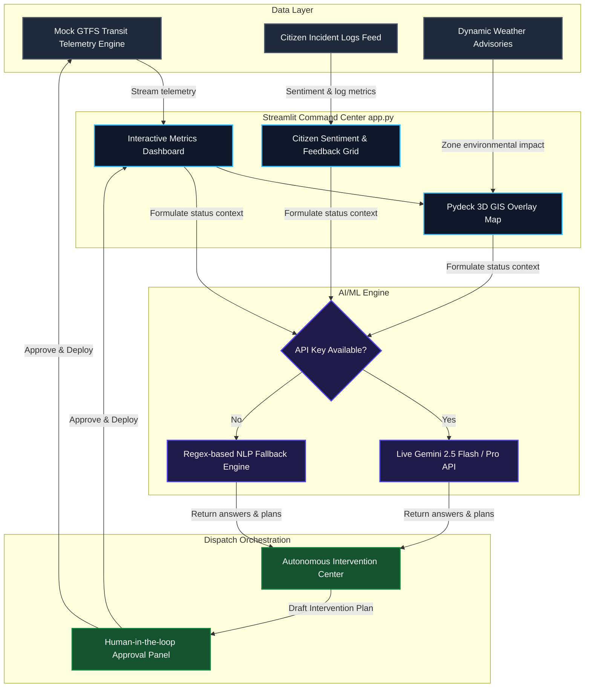

# 🚀 AuraFlow: AI-Powered Urban Mobility & Predictive Decision Intelligence

[](https://cloud.google.com/)
[](https://cloud.google.com/vertex-ai)
[](https://deepmind.google/technologies/gemini/)
[](https://streamlit.io/)
[](https://www.python.org/)
[](#)

AuraFlow is a next-generation **Real-Time Decision Intelligence & Predictive Orchestration Platform for Urban Mobility and Public Transit**. Engineered specifically for the **APAAC Cohort 2 Hackathon**, AuraFlow resolves the disconnect between disparate city data streams (GTFS public transit feeds, traffic camera simulation coordinates, weather alerts, and natural language citizen feedback) by centralizing them into a single-file, highly resilient Command Center.

---

## 📖 Table of Contents
- [Project Overview & Problem Statement](#-project-overview--problem-statement)
- [System Architecture](#%EF%B8%8F-system-architecture)
- [What Makes AuraFlow Different?](#-what-makes-auraflow-different)
- [Technology Stack](#%EF%B8%8F-technology-stack)
- [How to Run Locally](#-how-to-run-locally)
- [Features Checklist](#-features-checklist)

---

## 🌐 Project Overview & Problem Statement

Modern city mobility management is severely fragmented. Dispatchers and controllers struggle with:
1. **Disconnected Data Streams:** GTFS schedule feeds, weather radar, and public complaints reside in isolated silos.
2. **Delayed Response Times:** Interventions occur *after* gridlocks or accidents peak, causing severe cascading delays across transit grids.
3. **Complex Query Barriers:** Retrieving critical insights typically requires specialized GIS database skills, delaying time-critical routing decisions.

**AuraFlow solves this by creating a real-time, predictive command layer.** It translates spatial city feeds into clean dashboards and incorporates a conversational **AI Decision Co-Pilot** that drafts and deploys automated, human-in-the-loop intervention plans (bus rerouting, smart signal light adjustments, public broadcasts) in seconds.

---

## 🏗️ System Architecture

The following diagram illustrates AuraFlow's end-to-end data pipelines, AI orchestration, and feedback loops:



---

## 🌟 What Makes AuraFlow Different?

- **⚡ Single-File Resiliency:** AuraFlow is consolidated entirely within `app.py` using Streamlit. This guarantees high reliability, minimal footprint, and zero-latency loading.
- **🚗 Predictive Intervention Engine:** Unlike standard analytical dashboards, AuraFlow generates complete operational intervention recommendations. It tells controllers precisely *where* to dispatch tow trucks, *how many seconds* to extend green lights, and *which* detour routes to assign.
- **🛡️ Fail-Safe Simulation Fallback:** If the Vertex AI/Gemini API key is missing or encounters rate limits, AuraFlow automatically activates a built-in NLP matching and response generator. The dashboard remains fully interactive and functional during critical offline demos.
- **💬 Natural Language Command Interface:** City controllers can ask complex questions such as *"Is the heavy rain alert affecting Route M15?"* and receive immediate, structured answers derived directly from real-time simulated telemetry.

---

## 🛠️ Technology Stack

- **Dashboard UI & GIS Engine:** 
  - [Streamlit](https://streamlit.io/) for dashboard layout and reactive state management.
  - [Pydeck](https://deckgl.github.io/pydeck/) for beautiful, interactive 3D geospatial scatterplot layers tracking active incident zones and bus coordinates.
  - [Pandas](https://pandas.pydata.org/) & [Tabulate](https://pypi.org/project/tabulate/) for real-time telemetry sorting and markdown generation.
- **Cognitive AI & Orchestration:**
  - [Google GenAI SDK](https://github.com/googleapis/google-genai) utilizing `gemini-2.5-flash` for contextual urban mobility reasoning.
  - Custom system context builder mapping simulated BigQuery geospatial metrics & AlloyDB pgvector incident queries directly into the model.

---

## 🏃 How to Run Locally

### 1. Clone the Project Workspace
```bash
git clone <your-repository-url>
cd COHORT-2-HACKATHON
```

### 2. Install Required Dependencies
Ensure you have Python 3.10+ installed. Run:
```bash
pip install -r requirements.txt
```

### 3. Setup your Environment Variables (Optional)
To run with live Gemini AI capabilities, set your Google Gemini API key:
```bash
# Windows Command Prompt
set GEMINI_API_KEY=your_gemini_api_key_here

# Windows PowerShell
$env:GEMINI_API_KEY="your_gemini_api_key_here"

# Linux / macOS
export GEMINI_API_KEY="your_gemini_api_key_here"
```
*Note: If no API key is specified, the application will launch in **Simulated AI Fallback Mode** so you can test all features without configuration.*

### 4. Run the Streamlit Platform
Launch the dashboard command center locally:
```bash
streamlit run app.py
```
The application will open in a new tab in your default web browser (typically at `http://localhost:8501`).

---

## ✅ Features Checklist

- [x] **AuraFlow Simulation Grid:** Dynamic generation of GTFS delays, weather conditions, and accident reports.
- [x] **3D Map Visualization:** Color-coded coordinates tracking active fleet delays and crash severities.
- [x] **Conversational AI Co-Pilot:** Instant query-response interface built using Vertex AI/Gemini structures.
- [x] **Intervention Plans:** Automatic generation of detour routes, signal timings, and dispatch plans with one-click deployment.
- [x] **Zero-Crash Uptime:** Automatic local fallback implementation for offline evaluation.
